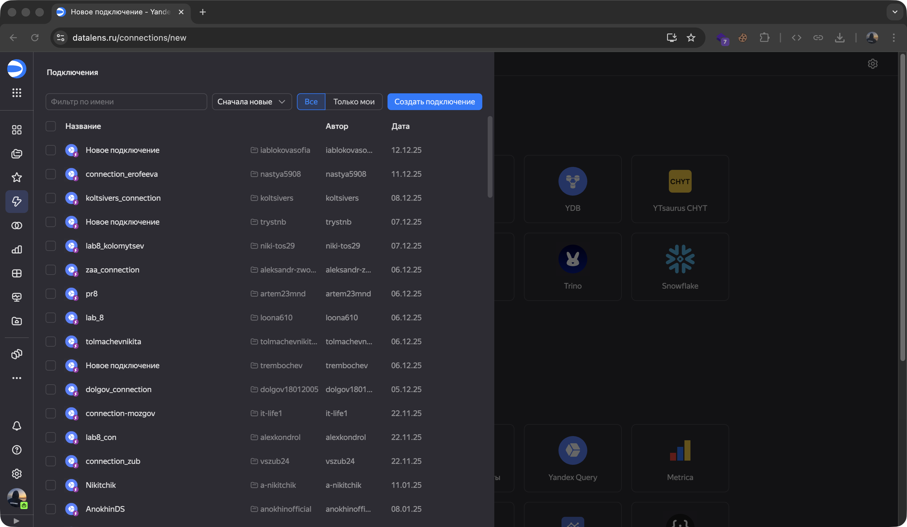
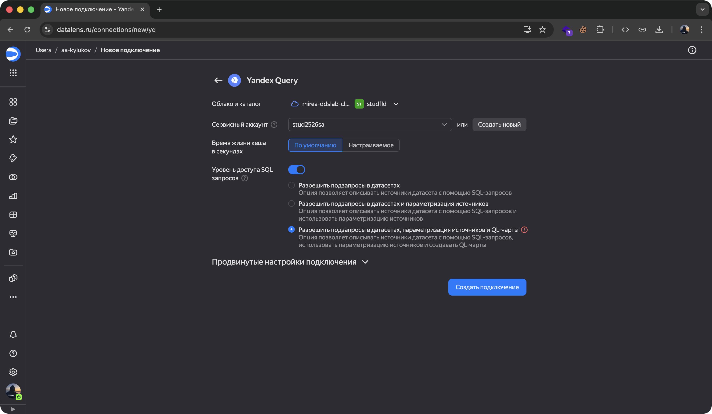
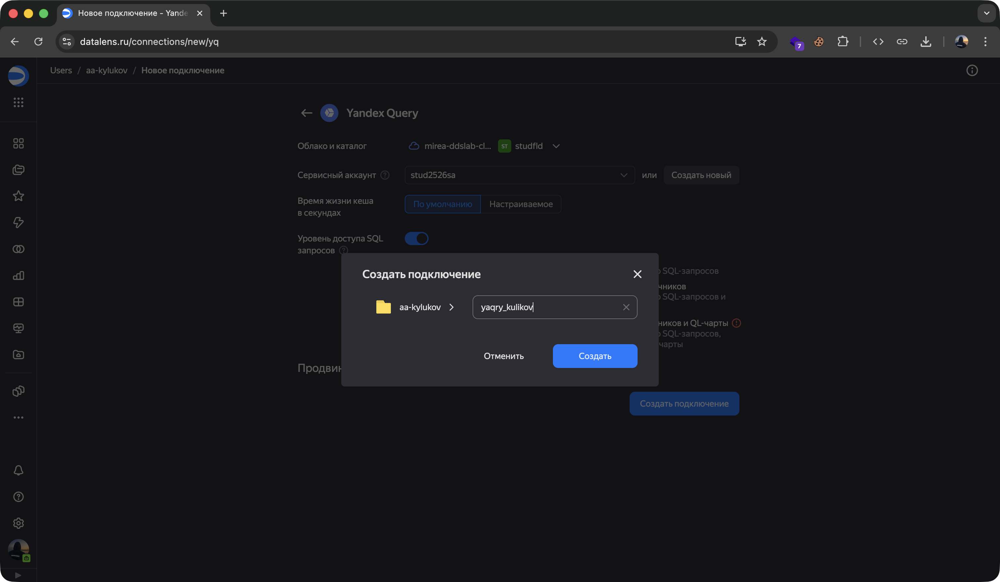
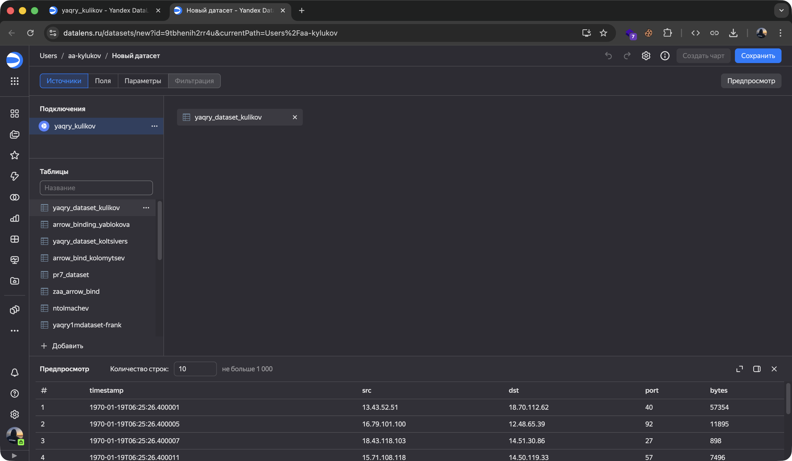
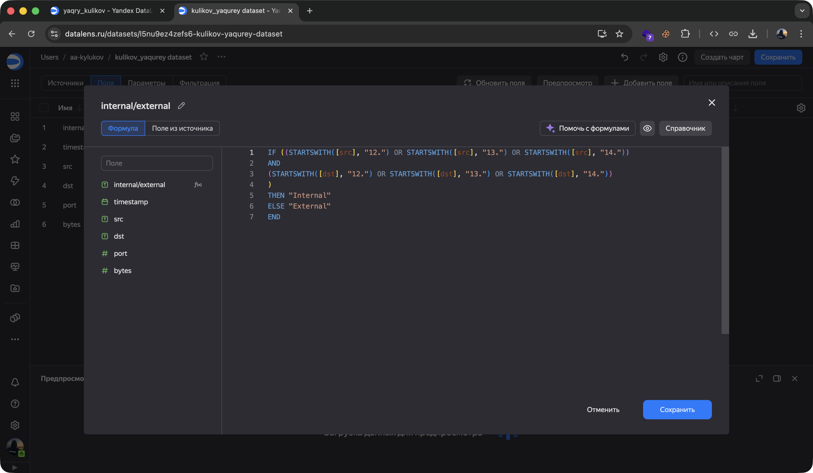
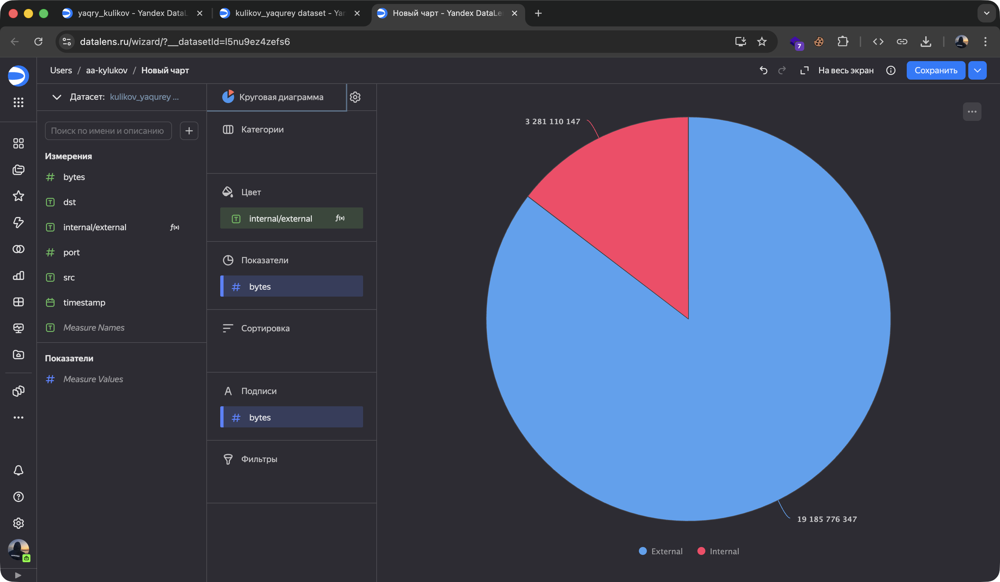
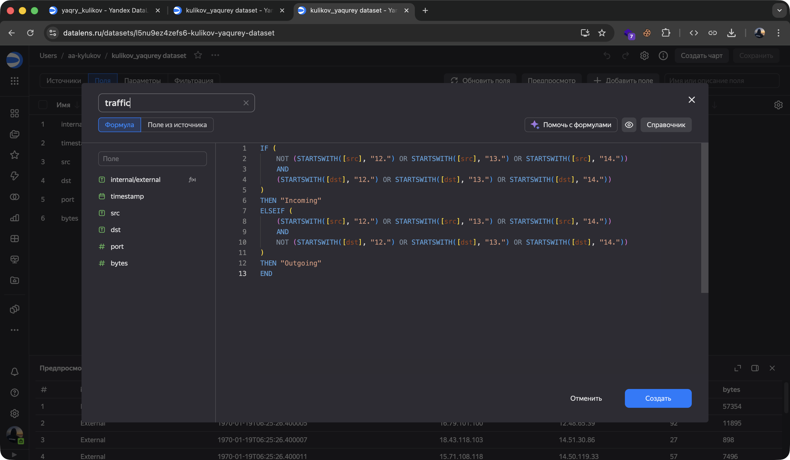
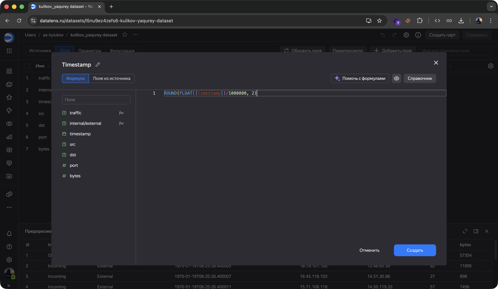
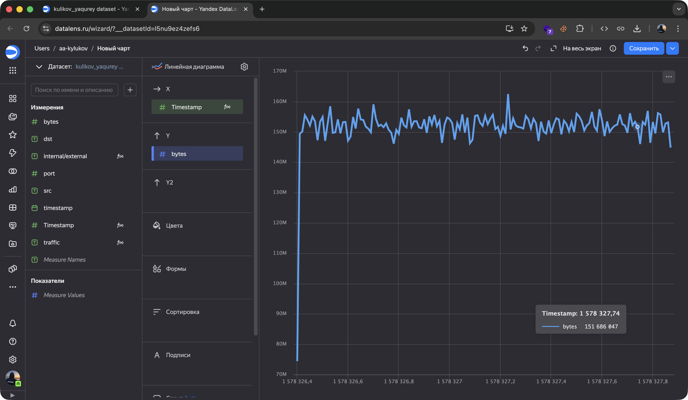
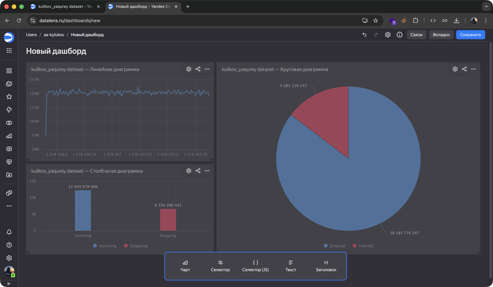

# README
aa-kylukov@yandex.ru

# Использование технологии Yandex DataLens для анализа данных сетевой активности

## Цель работы

1.  Изучить возможности технологии Yandex DataLens для визуального
    анализа структурированных наборов данных
2.  Получить навыки визуализации данных для последующего анализа с
    помощью сервисов Yandex Cloud
3.  Получить навыки создания решений мониторинга/SIEM на базе облачных
    продуктов и открытых программных решений
4.  Закрепить практические навыки использования SQL для анализа данных
    сетевой активности в сегментированной корпоративной сети

## Исходные данные

1.  Ноутбук с ОС MacOS
2.  RStudio
3.  Интерпретатор языка R 4.5.1
4.  Доступ в интернет

## Общий план выполнения

1.  Настроить подключение к DataLens
2.  Создать из запроса YandexQuery датасет DataLens
3.  Создать графики и диаграммы
4.  Создать дашборд

### Шаг 1. Настройка подключения DataLense

#### Создание подключения

#### Настройка параметров подключения

 

### Шаг 2. Создание датасета в DataLense

### Шаг 3. Создание графиков

#### Создание круговой диаграммы

 

#### Создание столбчатой диаграммы

 

#### Создание линейного графика

 

### Шаг 4. Создание дашборда

 Ссылка на дашборд -
https://datalens.ru/rbt1wpklldloc-dashboard-kulikov

## Оценка результата и вывод

В рамках работы: настроен DataLens, созданы датасеты и визуализации для
анализа сетевого трафика. Использованы SQL-запросы для классификации
трафика. Инструмент показал эффективность для визуализации данных и
построения дашбордов

## Вывод

В ходе работы освоен Yandex DataLens для визуализации сетевой
активности. Созданные дашборды позволяют наглядно анализировать трафик,
а применение SQL для классификации потоков подтвердило практическую
ценность инструмента в задачах мониторинга и безопасности.
